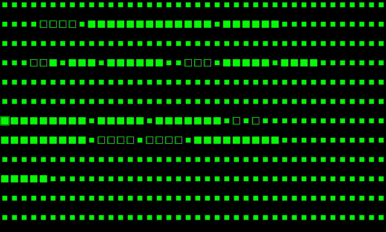
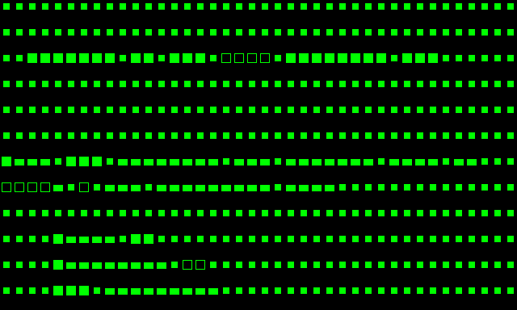

# EmulatorGUI - Interfaz de Terminal Retro

## Descripción General

El EmulatorGUI proporciona una interfaz gráfica de usuario que emula el aspecto y comportamiento de las computadoras de 8 bits de la década de 1980 como Apple II, Commodore 64 y MSX. Presenta una pantalla clásica de 40x24 caracteres con colores retro y un cursor de bloque parpadeante, devolviendo la experiencia nostálgica de la computación vintage.

## Características

- **Pantalla Retro Auténtica**: Pantalla basada en caracteres de 40 columnas × 24 filas
- **Paleta de 16 Colores**: Esquema de colores inspirado en Apple II/Commodore 64
- **Cursor de Bloque**: Cursor parpadeante clásico como en las terminales vintage
- **Entrada de Teclado**: Soporte completo de teclado con manejo de caracteres especiales
- **Backend SDL2**: Renderizado acelerado por hardware para un rendimiento fluido
- **Integración con TextScreen**: Se conecta perfectamente con el dispositivo TextScreen existente

## Paleta de Colores

La GUI implementa una paleta de 16 colores inspirada en computadoras clásicas de 8 bits:

| Índice | Nombre Color | Valor RGB    | Uso                      |
|--------|-------------|--------------|--------------------------|
| 0      | Negro       | #000000      | Fondo                    |
| 1      | Rojo Oscuro | #880000      | Mensajes de error        |
| 2      | Azul Oscuro | #0000CC      | Encabezados              |
| 3      | Púrpura     | #DD22DD      | Texto especial           |
| 4      | Verde Oscuro| #008800      | Mensajes de éxito        |
| 5      | Gris        | #808080      | Texto deshabilitado      |
| 6      | Azul Medio  | #2222FF      | Enlaces/Comandos         |
| 7      | Azul Claro  | #66DDFF      | Resaltados               |
| 8      | Marrón      | #885500      | Advertencias             |
| 9      | Naranja     | #FF6600      | Avisos importantes       |
| 10     | Rosa        | #CCCCCC      | Gris claro               |
| 11     | Rojo Claro  | #FF9999      | Errores claros           |
| 12     | Verde Claro | #00FF00      | **Texto/Cursor Predeterminado** |
| 13     | Amarillo    | #FFFF00      | Resaltados brillantes    |
| 14     | Aguamarina  | #00FFFF      | Resaltados especiales    |
| 15     | Blanco      | #FFFFFF      | Texto brillante          |

La configuración predeterminada usa **Verde Claro (#00FF00)** para el texto sobre un fondo **Negro (#000000)**, imitando las pantallas de terminal clásicas.

## Compilación

La GUI requiere que SDL2 esté instalado en tu sistema:

### Ubuntu/Debian
```bash
sudo apt-get install libsdl2-dev
```

### Compilar con CMake
```bash
mkdir build && cd build
cmake ..
make gui_demo
```

## Uso

### Ejemplo Básico

```cpp
#include "gui/emulator_gui.hpp"
#include "devices/text_screen.hpp"
#include <memory>

int main() {
    // Crear GUI con caracteres de 16x16 píxeles
    EmulatorGUI gui("Mi Computadora 6502", 16, 16);
    
    // Inicializar la ventana
    if (!gui.initialize()) {
        return 1;
    }
    
    // Crear y adjuntar TextScreen
    auto textScreen = std::make_shared<TextScreen>();
    gui.attachTextScreen(textScreen);
    
    // Escribir mensaje de bienvenida
    const char* msg = "¡Hola, Mundo!";
    for (const char* p = msg; *p; p++) {
        textScreen->writeCharAtCursor(*p);
    }
    
    // Bucle principal
    while (gui.isInitialized()) {
        // Manejar entrada de teclado
        if (gui.hasKey()) {
            char key = gui.getLastKey();
            textScreen->writeCharAtCursor(key);
        }
        
        // Actualizar y renderizar
        gui.update();
        
        // Pequeño retraso para ~60 FPS
        SDL_Delay(16);
    }
    
    return 0;
}
```

### Ejecutar la Demo

La demo incluida muestra las características de la GUI:

```bash
cd build
./gui_demo
```

La demo muestra:
1. **Pantalla de Bienvenida**: Información sobre las características de la GUI
2. **Secuencia de Arranque**: Inicio simulado de BASIC (como Microsoft BASIC 1.0)
3. **Modo Interactivo**: Escribe en el teclado y ve los caracteres aparecer

**Controles:**
- Escribe cualquier tecla para verla aparecer en pantalla
- Presiona **ENTER** para crear un nuevo prompt
- Presiona **ESC** para salir

## Referencia de API

### Constructor

```cpp
EmulatorGUI(const std::string& title = "6502 Emulator", 
            int charWidth = 16, 
            int charHeight = 16);
```

- `title`: Título de la ventana
- `charWidth`: Ancho del carácter en píxeles (predeterminado: 16)
- `charHeight`: Alto del carácter en píxeles (predeterminado: 16)

El tamaño de la ventana se calcula automáticamente: `640x384` píxeles (40×16 por 24×16)

### Métodos

#### `bool initialize()`
Inicializa SDL2 y crea la ventana. Debe llamarse antes de usar la GUI.

**Retorna:** `true` si tiene éxito, `false` si falla

#### `void attachTextScreen(std::shared_ptr<TextScreen> screen)`
Adjunta un dispositivo TextScreen para salida de pantalla.

**Parámetros:**
- `screen`: Puntero compartido a una instancia de TextScreen

#### `bool update()`
Bucle principal de actualización - procesa eventos, maneja el parpadeo del cursor y renderiza la pantalla.

**Retorna:** `true` para continuar ejecutando, `false` para salir

#### `void render()`
Renderiza el contenido actual de la pantalla en la ventana.

#### `void clear()`
Limpia la pantalla al color de fondo.

#### `char getLastKey()`
Obtiene la última tecla presionada y limpia el búfer de teclas.

**Retorna:** Código ASCII de la tecla, o 0 si no se presionó ninguna tecla

#### `bool hasKey() const`
Verifica si hay una tecla disponible en el búfer.

**Retorna:** `true` si se presionó una tecla

#### `bool isInitialized() const`
Verifica si la GUI está inicializada y ejecutándose.

**Retorna:** `true` si está inicializada

## Integración con el Emulador de CPU

La GUI se integra perfectamente con el emulador de CPU 6502 y el dispositivo TextScreen:

```cpp
#include "cpu.hpp"
#include "mem.hpp"
#include "gui/emulator_gui.hpp"
#include "devices/text_screen.hpp"

int main() {
    // Inicializar componentes
    Mem mem;
    CPU cpu;
    auto textScreen = std::make_shared<TextScreen>();
    EmulatorGUI gui("Computadora 6502", 16, 16);
    
    // Configuración
    cpu.Reset(mem);
    cpu.registerIODevice(textScreen);
    gui.initialize();
    gui.attachTextScreen(textScreen);
    
    // Cargar programa en memoria (ejemplo)
    mem[0x8000] = 0xA9; // LDA #'H'
    mem[0x8001] = 'H';
    mem[0x8002] = 0x8D; // STA $FFFF (escribir en pantalla)
    mem[0x8003] = 0xFF;
    mem[0x8004] = 0xFF;
    
    // Bucle principal
    while (gui.isInitialized()) {
        // Ejecutar ciclos de CPU
        cpu.Execute(100, mem);
        
        // Manejar entrada de teclado
        if (gui.hasKey()) {
            char key = gui.getLastKey();
            // Podría escribir al búfer de teclado en $FD0C
        }
        
        // Actualizar GUI
        gui.update();
        SDL_Delay(16);
    }
    
    return 0;
}
```

## Arquitectura

### Renderizado de Caracteres

La GUI utiliza un enfoque de renderizado geométrico simplificado:
- **Letras mayúsculas (A-Z)**: Rectángulos rellenos con un pequeño espacio
- **Letras minúsculas (a-z)**: Rectángulos más pequeños en la porción inferior
- **Números (0-9)**: Rectángulos con contorno
- **Otros caracteres**: Pequeños bloques rellenos

Esto crea una estética retro "blocky" distintiva similar a las primeras pantallas de computadora.

### Cursor

El cursor se renderiza como un bloque semi-transparente que parpadea cada 500ms, imitando el comportamiento de las terminales vintage. La velocidad de parpadeo se puede ajustar modificando la constante `CURSOR_BLINK_RATE`.

### Búfer de Pantalla

La GUI lee directamente del búfer de 40×24 caracteres del TextScreen y lo renderiza en tiempo real. Los cambios en el TextScreen se reflejan inmediatamente en la pantalla.

## Especificaciones Técnicas

- **Resolución de Pantalla**: 640×384 píxeles (configurable mediante tamaño de carácter)
- **Cuadrícula de Caracteres**: 40 columnas × 24 filas (960 caracteres)
- **Tamaño de Carácter**: 16×16 píxeles (predeterminado, configurable)
- **Velocidad de Fotogramas**: ~60 FPS (con retraso de 16ms)
- **Velocidad de Parpadeo del Cursor**: 500ms (2 Hz)
- **Huella de Memoria**: Mínima - usa el búfer existente del TextScreen

## Capturas de Pantalla

### Pantalla de Arranque


La clásica secuencia de arranque de Microsoft BASIC 1.0, mostrando la información del sistema y el prompt listo.

### Pantalla de Bienvenida


Mensaje de bienvenida demostrando la pantalla de 40×24 caracteres y la paleta de colores retro.

## Mejoras Futuras

Mejoras potenciales para versiones futuras:

1. **Soporte de Fuentes Bitmap**: Cargar fuentes retro personalizadas (ej. fuentes de Apple II, C64)
2. **Atributos de Color**: Colores de primer plano/fondo por carácter
3. **Efectos de Líneas de Barrido**: Líneas de barrido estilo CRT para autenticidad
4. **Brillo de Fósforo**: Persistencia de fósforo simulada
5. **Múltiples Modos de Pantalla**: Modos gráficos además del modo de texto
6. **Soporte de Sonido**: Emulación de altavoz/beeper
7. **Modo Pantalla Completa**: Experiencia retro inmersiva
8. **Paletas Configurables**: Cambiar entre diferentes paletas de computadoras vintage

## Solución de Problemas

### Error de Inicialización de SDL2
**Problema:** La inicialización de SDL falla con un mensaje de error.

**Solución:** Asegúrate de que SDL2 esté correctamente instalado:
```bash
sudo apt-get install libsdl2-dev
pkg-config --modversion sdl2
```

### La Ventana No Aparece
**Problema:** La ventana se crea pero no es visible.

**Solución:** 
- Verifica si se está ejecutando en un entorno sin cabeza (headless)
- Usa `xvfb-run -a ./gui_demo` para pruebas con pantalla virtual
- Verifica que las variables de entorno de pantalla estén configuradas

### Los Caracteres No Se Renderizan
**Problema:** La pantalla está en blanco a pesar de que TextScreen tiene contenido.

**Solución:**
- Asegúrate de que se llamó a `attachTextScreen()`
- Verifica que TextScreen contenga caracteres ASCII imprimibles (0x20-0x7E)
- Verifica que `update()` se esté llamando en el bucle principal

## Licencia

Esta GUI es parte del proyecto de emulador cpu6502 y sigue los mismos términos de licencia.

## Créditos

Inspirado en:
- Apple II (1977)
- Commodore 64 (1982)
- Computadoras MSX (1983)
- Emuladores de terminal clásicos

La estética retro rinde homenaje a la edad de oro de la computación de 8 bits.
